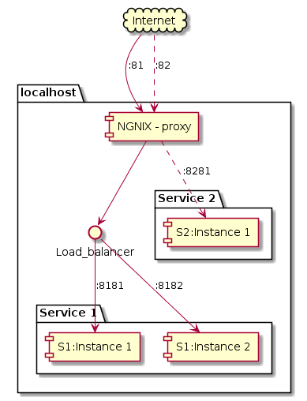

# Proxy-world

Learning about `ngnix` and proxies, load balancing, etc.

### Todo:s
9. `docker-compose` for `nginx-consul-template`
13. Flask monitor file change
10. Run flask app from nginx ([link](https://www.digitalocean.com/community/tutorials/how-to-serve-flask-applications-with-uwsgi-and-nginx-on-ubuntu-14-04), [link2](https://github.com/tiangolo/uwsgi-nginx-flask-docker))
11. Websocket flask app
12. Create and push docker for simple web app

### Target system view


### Starting system
```bash
docker run  -p 80:80 --rm --name world-proxy \
            -v $(pwd)/nginx.conf:/etc/nginx/nginx.conf \
            nginx
```

### Done:s
1. ~~Simple redirect to google~~
3. ~~Plantuml for system~~
5. ~~Create github repo~~
2. ~~Load balancing between two services~~
4. ~~Docker-compose to start system~~
5. ~~Path-proxy~~
2. ~~Use consul for service discovery [link](https://github.com/hashicorp/consul-template/blob/master/examples/nginx.md). [competitor?](https://github.com/avthart/docker-consul-template/blob/master/examples/examples.md)~~
3. ~~Reload consul data [link](https://serverfault.com/questions/378581/nginx-config-reload-without-downtime)~~
10. ~~Update PlantUml for `nginx-consul-template`~~

## References
[Using env variables in nginx conf](https://docs.docker.com/samples/library/nginx/)
[online PlantUML editor](https://www.planttext.com/)
