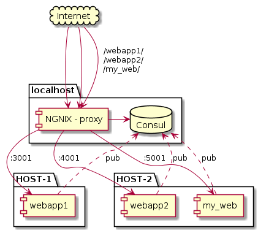

# NGINX-CONSUL-TEMPLATE
Dynamic port forwarding using `nginx` and `consul`. When a service is started and it's service is added (or removed) in consul, `consul-template` will detect the change and reload the `nginx` conf file, creating dynamic forwarding to the right host.



## Build and run the docker
build `nginx-consul-template`
```bash
docker build -t nginx-consul-template .
```

run `nginx-consul-template` docker
```
docker run  --rm -p 80:80 -it -v $PWD/:/tmp/ \
            --name dyn-nginx \
            nginx-consul-template \
            -consul-addr=192.168.0.10:8500
```

Add new service
```
curl -X PUT -d '{"Datacenter": "dc1", "Node": "google", "Address": "www.google.com", "Service": {"Service": "webby'$(( ( RANDOM % 200 ) + 1 ))'", "Port": 80}}' http://127.0.0.1:8500/v1/catalog/register
```


# Misc


## Minimal example of 

Start standalone consul-template for testing
```
docker run -v $PWD/:/tmp/ --entrypoint=bash -it avthart/consul-template
```

```
consul-template -consul-addr=192.168.0.10:8500 -template example.ctmpl -dry
```


**Template command**
```
consul-template -consul-addr=192.168.0.10:8500 -template nginx.ctml:here.txt --verbose
``

## This is pretty sick, if it works
[link](https://github.com/hashicorp/consul-template)
Render multiple templates in the same process. The optional third argument to the template is a command that will execute each time the template changes.
```bash
$ consul-template \
    -template "/tmp/nginx.ctmpl:/var/nginx/nginx.conf:nginx -s reload" \
    -template "/tmp/redis.ctmpl:/var/redis/redis.conf:service redis restart" \
    -template "/tmp/haproxy.ctmpl:/var/haproxy/haproxy.conf"
```